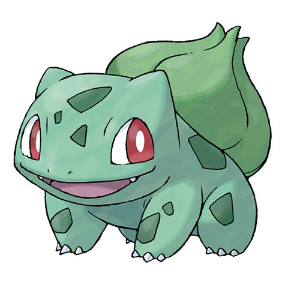
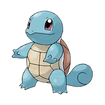

# Pokédex

A responsive and interactive web-based Pokédex application featuring all 151 original Kanto region Pokémon. Built using HTML, CSS, JavaScript, and Bootstrap, this project provides a clean interface to explore and search for your favorite Pokémon.


## Features

- **Complete Kanto Pokédex**: Browse through all 151 original Pokémon (Bulbasaur to Mew).
- **Search Functionality**: Easily search for any Pokémon by its name (e.g., "Pikachu") or its Pokédex number (e.g., "025").
- **Detailed Pokémon Pages**: Each Pokémon has a dedicated page showcasing its information.
- **Responsive Design**: fully optimized for both desktop and mobile viewing experiences.
- **Type-based Styling**: Pokémon cards display type icons (e.g., Grass, Fire, Water) and are styled accordingly.

## Demo


*A quick look at some of the Pokémon you can find in the Pokédex.*
<div>
  
  
  
  
  
</div>

## Technologies Used

- **HTML5**: For the structure and content of the web pages.
- **CSS3**: For custom styling, animations, and responsive layouts.
- **JavaScript (Vanilla JS)**: For implementing search logic and dynamic interactions.
- **Bootstrap (v4.6.0 / v5.2.1)**: Utilized for grid layouts and responsive components.

## Project Structure

```
├── index.html           # Landing page
├── home.html            # Main Pokédex grid and search page
├── about.html           # About page
├── contact.html         # Contact page
├── main-script.js       # Search logic and interactive functions
├── main-styles.css      # Core styling for the main interface
├── poke-pages/          # Dedicated HTML pages for each of the 151 Pokémon
├── pokemon/             # High-quality images for each Pokémon
├── types/               # Pokémon type icons (e.g., fire, water, bug)
└── misc/                # Backgrounds, logos, and other UI assets
```

## How to Run Locally

Since this is a static web project, you don't need any complex server setup to run it!

1. Clone this repository or download the source code.
2. Open the project folder.
3. Simply double-click on `index.html` to open it in your default web browser.
4. Click "Enter" to navigate to the main Pokédex page and start exploring!

---
*Created by Prasham Desai*
